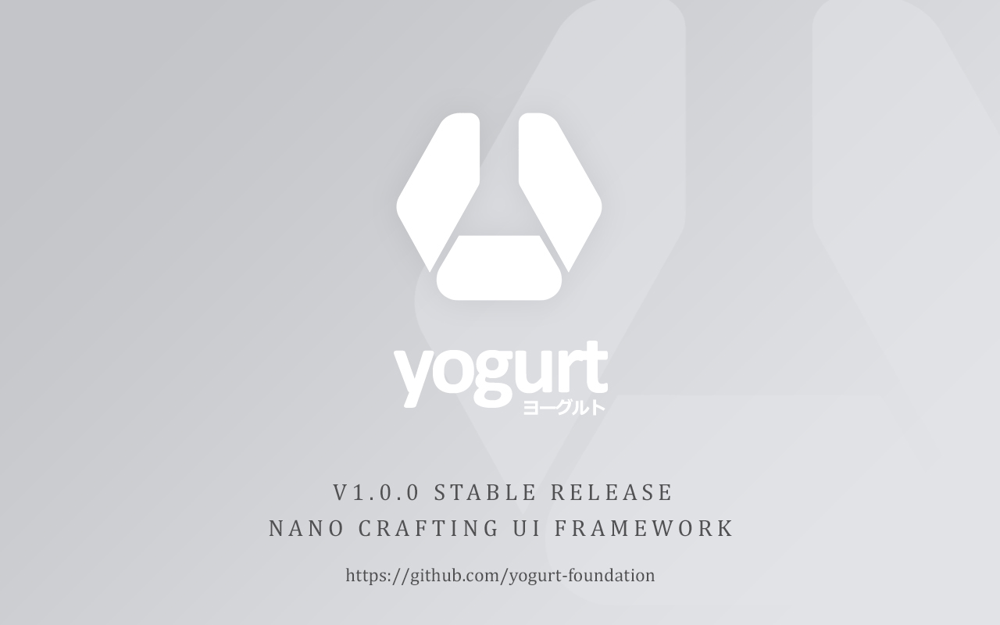

  

  
  
  
  
  
  
  
  
  
  
  
  
  
  
  
  

A colossal low-level utility CSS framework for crafting beautiful and elegant user interface at an atomic level without writing a single line of CSS.

> Version 1.0.8-solidcore-beta

> The `SOLID CORE` means the next major Yogurt CSS update is depending on any major release of the CSS version. It also means you will less frequently updating the framework for your frontend development. Which makes this utility framework a futureproof.

### Introduction

Yogurt is a CSS framework for crafting custom UI designs by using very smaller building block to build a component, even a basic component like a button can look entirely different from one to another in your material designs and having a complex template design that you'd end up needing to override the CSS will only make the creation process more frustrating.

Yogurt does not include any kind of component classes, unlike many other CSS frameworks. Yogurt using the humanized naming convention such as `font-size`, `padding`, `margin`, `line-height`, `color`, and so on, it's easy to reason about, easy to manipulate and more readable code. Yogurt also delivers a balance between consistency and flexibility design without overwriting existing stylesheets and unlike many CSS frameworks. Play well with your CSS, library, and frameworks. No side effects. Support up to 4k screen size enabled by default.

### _support

[Read the Documentation](https://yogurt-css-documentation.netlify.app).

Join our community channel at [Discord](https://discord.gg/A62YjNR), [Twitter](https://twitter.com/yogurtcss).

### _prototype

Unpulished prototypes are located in the [laboratory](https://github.com/yogurt-foundation/laboratory) page.

### _other tools

- [FX-Motion](https://github.com/yogurt-foundation/fx-motion), CSS animation library, total 187 effects.
- [FX-Filter](https://github.com/yogurt-foundation/fx-filter), CSS filter library, total 26 effects [(previewer)](https://fx-filter-previewer.netlify.com/).
- [FX-Gradient](https://github.com/yogurt-foundation/fx-gradient), CSS gradient library, total 169 effects [(previewer)](https://fx-gradient-previewer.netlify.com/).

---

[MIT](https://github.com/yogurt-foundation/yogurt-css/blob/master/LICENSE)
