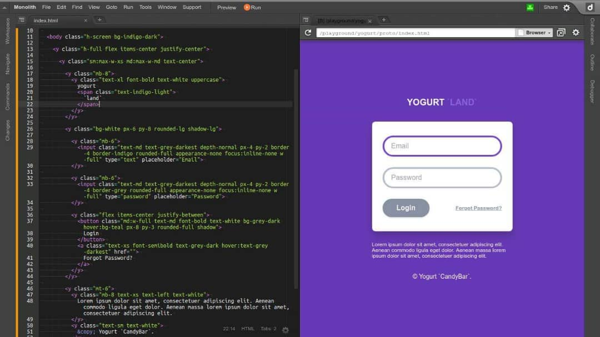

<p align="left">
  
</p>

<p align="left">
  
  
  
  
  
  
  
  
  
  
  
  
</p>

# yogurt (2.0.0-proto)

> A colossal size CSS framework for manipulating utility in analogue or stepping controls.

This toolkit allows me to manipulates the `font-size`, `padding`, `margin`, `line-height`, `color`, and so on, with analog or stepping utility control. I am more prefer atomized css selectors with added full-range of different settings for me to choose from, so that I can less or even not to messing with the CSS.

### abstract

In this concept, the `margin`, `padding`, `font-size` and so on are considered as `utility` components. Using the `first initial letter prefixing` (e.g. `b` as `border`) combines with preset `value` (or `strength` value) makes perfect sense to mix among the utilties to form a complex styling with CSS. The `value` or `strength` value giving linear options changing the properties of an utility either in an analog-alike or steppin-alike, which gives you a `low-level` control over this framework. The `Sass` being used on this concept is acting like a compiler or `generator` for generating distributable asset (e.g. /dist/yogurt.min.css), the asset is not use as library import in your project, instead you generate new one if any changes to the core with `yogurt.scss` by using `Sass` preprocessor.

### concept

<p align="left">
  
  
  
  
  
  
</p>

### _get

```bash
$ git clone https://github.com/loouislow81/yogurt-foundation.git
$ cd yogurt-foundation
$ yarn install
```

### _build

```bash
$ yarn build
```

### _usage

```html
<head>
  ...
    <link rel="stylesheet" href="dist/yogurt.css">
  ...
</head>
```

---

Also added passive features for image, video and text enhancements.

Enjoy!

---

[MIT](https://github.com/loouislow81/yogurt-foundation/blob/master/LICENSE)
